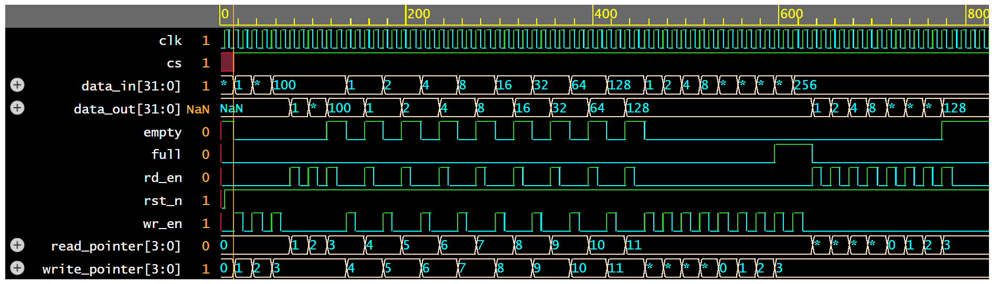

# 🔁 FIFO_Verilog

> A fully functional, synthesizable Synchronous FIFO design implemented in Verilog — built for clarity, correctness, and real-world digital design practice.

---

## 📌 Project Overview

This project implements a **Synchronous First-In-First-Out (FIFO)** memory buffer in Verilog. Both the write and read operations are controlled by the same clock signal. The design includes essential status flags such as **full** and **empty**, making it suitable for use in digital communication, data buffering, and FPGA-based systems.

---

## ⚙️ FIFO Parameters

| Parameter   | Value       |
|-------------|-------------|
| Data Width  | 32 bits     |
| FIFO Depth  | 8 locations |
| Type        | Synchronous |
| Language    | Verilog HDL |

---

## 🗂️ File Structure

```
FIFO_Verilog/
├── fifo_d.v       # FIFO design - datapath and control logic
├── fifo_tb.v      # Testbench - simulation and verification
├── waveform.png   # Simulation output waveform
└── readME.md      # Project documentation
```

---

## 🔌 Port Description

| Port Name  | Direction | Width  | Description                    |
|------------|-----------|--------|--------------------------------|
| `clk`      | Input     | 1-bit  | Clock signal                   |
| `rst_n`    | Input     | 1-bit  | Active-low reset               |
| `cs`       | Input     | 1-bit  | Chip select                    |
| `wr_en`    | Input     | 1-bit  | Write enable                   |
| `rd_en`    | Input     | 1-bit  | Read enable                    |
| `data_in`  | Input     | 32-bit | Data input to FIFO             |
| `data_out` | Output    | 32-bit | Data output from FIFO          |
| `full`     | Output    | 1-bit  | High when FIFO is full         |
| `empty`    | Output    | 1-bit  | High when FIFO is empty        |

---

## 🧱 Block Diagram

```
          +--------------------------+
          |      Synchronous FIFO    |
          |                          |
 data_in  |  wr_en --> [ Write Ptr ] |
 -------> |                          | --> data_out
          |       [ Memory Array ]   |
 wr_en    |       [  8 x 32-bit  ]   | --> full
 -------> |                          | --> empty
 rd_en    |  rd_en --> [ Read Ptr  ] |
 -------> |                          |
          |   clk, rst_n, cs         |
          +--------------------------+
```

---

## 🖥️ Simulation

This project is simulated using **EDA Playground** ([https://edaplayground.com](https://edaplayground.com)).

### Steps to Simulate:

1. Go to [EDA Playground](https://edaplayground.com)
2. Create a new playground
3. Select your simulator (e.g., **Icarus Verilog 0.9.7**)
4. Paste `fifo_d.v` in the **Design** panel
5. Paste `fifo_tb.v` in the **Testbench** panel
6. Check **"Open EPWave after run"** to view waveforms
7. Click ▶️ **Run**

---

## 📈 Simulation Output



### Waveform Description

| Scenario                  | Expected Output                             |
|---------------------------|---------------------------------------------|
| Reset asserted            | `empty = 1`, `full = 0`, pointers reset     |
| Sequential writes (8)     | Data fills FIFO; `full = 1` after 8 writes  |
| Write when full           | Write ignored; `full` stays high            |
| Sequential reads (8)      | Data read in order written (FIFO behavior)  |
| Read when empty           | Read ignored; `empty` stays high            |
| Simultaneous read & write | Data flows through; flags update correctly  |

---

## 👩‍💻 Author

**Shreelakshmi K R**
- GitHub: [@shreelakshmiKR](https://github.com/shreelakshmiKR)

---

## 📄 License

This project is licensed under the [MIT License](LICENSE).

---

## 🌱 Future Improvements

- [ ] Implement Asynchronous FIFO variant
- [ ] Add GitHub Actions for automated linting
- [ ] Add synthesis constraints file
